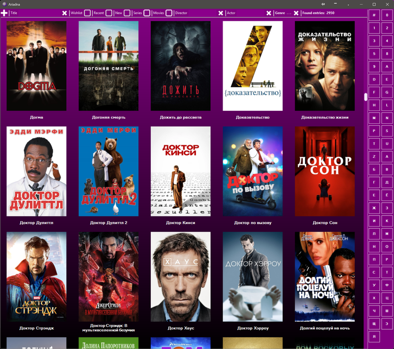

# Ariadna

A Windows desktop app for managing a personal media library — movies, documentaries, games, and books — with poster thumbnails and rich metadata.


**Status:** the WinForms catalog now uses SQLite through a focused storage layer.
Entity Framework, SQL Server LocalDB, and the legacy DbProvider project are removed.
The native WPF frontend is implemented alongside WinForms for acceptance testing;
see [WPF migration](docs/WPF-MIGRATION.md). Both use the existing SQLite catalog
and images without another data conversion.
See [docs/PLAN.md](docs/PLAN.md) for remaining/upcoming tasks.

---



---

Launch without an argument to open Movies, or select an initial tab:

```
Ariadna.exe movies          # Movies & TV series
Ariadna.exe documentaries   # Documentaries
Ariadna.exe games           # PC / VR games
Ariadna.exe library         # Books & documents
```

Movies, Documentaries, Games, and Library are four permanent tabs in one window.
After the initial page is shown, the remaining catalogs preload in the background,
including their initial poster viewport. Selecting a tab while it is still loading
shows a loading message until its prepared page is ready.
Each retains its own filters, selection, scroll position, palette, toolbar, and
genres while you switch. A second launch activates the existing window; a named
argument selects its tab, while no argument preserves the active tab. A requested
switch waits for an open modal editor to close.

Use **Ctrl+Tab** / **Ctrl+Shift+Tab** to cycle tabs, or **Ctrl+1** through **Ctrl+4**
to select Movies, Games, Library, or Documentaries directly, in visible tab order.

## What it does

- Browse the full collection as a scrollable poster grid
- Filter by title, director/author, actor, genre, or quick toggles (wishlist, new, series, VR)
- Open video files in MPC-HC or browse directories in Total Commander with one click
- Fetch movie metadata and posters automatically from TMDb
- Add entries manually or let the app discover new files on disk
- Edit metadata in a collection-specific form — cast/authors, genres, previews, file info, and MediaInfo stats

## Requirements

- Windows 10+ (x64), .NET 10.0
- .NET 10 SDK 10.0.401 or a newer 10.0.4xx patch for development; the self-contained Windows publish includes its runtime
- A verified SQLite catalog and its matching image folders
- Paths to your media folders and a [TMDb API key](https://developer.themoviedb.org/docs/getting-started) configured in `Ariadna.Wpf/App.config`

## Getting started

Open `Ariadna.slnx` in Visual Studio 2026 or an editor with SLNX support. The
solution contains all eight desktop, storage, migration, and test projects.
The desktop preserves its existing Windows-scaled UI size on high-DPI displays.
WinForms designers use a fixed 96-DPI baseline through `ForceDesignerDpiUnaware`;
close and reopen an already open designer after changing project settings.

`global.json` selects SDK 10.0.401 with patch updates allowed within 10.0.4xx;
preview SDKs are excluded. Dependencies use checked-in NuGet lock files:

```powershell
dotnet restore Ariadna.slnx --locked-mode
dotnet build Ariadna.slnx -c Release --no-restore
dotnet test Ariadna.slnx -c Release --no-build --no-restore
dotnet publish Ariadna/Ariadna.csproj -c Release -r win-x64 --self-contained true --no-restore -o publish
```

For the WPF frontend, run the project-built executable
`Ariadna.Wpf/bin/Debug/net10.0-windows8.0/Ariadna.Wpf.exe`, or select
`Ariadna.Wpf` as the startup project. It uses its own configuration in
`Ariadna.Wpf/App.config` and the same disposable catalog/asset environment overrides.
Close WinForms before using WPF with the live catalog. Start write acceptance on
a disposable matched copy; see the
[WPF acceptance sequence](docs/WPF-MIGRATION.md#build-and-test).

Close running instances before rebuilding. Launch
`Ariadna/bin/Release/net10.0-windows8.0/Ariadna.exe` with a mode above; no argument
defaults to movies. A missing catalog produces a recovery error instead of creating
an empty database. The separate `Ariadna.Migration` utility provides lossless export,
import, verification, and matched SQLite/image snapshots. See
[SQLite operation and recovery](docs/SQLITE-OPERATIONS.md) for configuration,
disposable test overrides, and backup/restore commands.

Release builds/tests and a self-contained win-x64 publish were verified during the
migration. Version 2.0.1 removes Windows API Code Pack and uses the bundled MediaInfo
reader for duration; existing-video regression tests cover details opening.
Version 2.1.0 gives each collection an independent detail form, composed from
shared controls and services. Version 3.0.0 requires .NET 10 for framework-dependent
runs and uses the six-project SLNX solution. Version 4.0.0 replaces separately
launched catalog windows with one instance and four permanent tabs. See
[PLAN.md](docs/PLAN.md) for the
verified checks and remaining manual integration review. A clean-machine
installation test remains open.

## Documentation

- [Changelog](CHANGELOG.md) — notable changes and version history by project
- [Technical Design Description](docs/Technical_Design_Description.md) — primary
  project reference for product behavior, architecture, configuration, and decisions
- [Implementation plan](docs/PLAN.md) — remaining/upcoming tasks and completion gates
- [SQLite operation and recovery](docs/SQLITE-OPERATIONS.md) — implemented format, configuration, verification, and backup/restore
- [SQLite migration investigation](docs/SQLITE-MIGRATION-PLAN.md) — original dated evidence and migration rationale
- [WPF migration](docs/WPF-MIGRATION.md) — native frontend, compatibility, launch and acceptance
- [AGENTS.md](AGENTS.md) / [MEMORY.md](MEMORY.md) — operational instructions and
  compact working handoff for contributors and agents

## Private data

The catalog, poster/preview directories, and TMDb credentials are local user
data. Committed fixtures and examples should use synthetic values. Configuration
currently contains local paths and an API-key setting: inspect it locally without
copying credential values into reports, screenshots, or logs. Database recovery
must include matching external images; ignore rules alone do not protect secrets.
