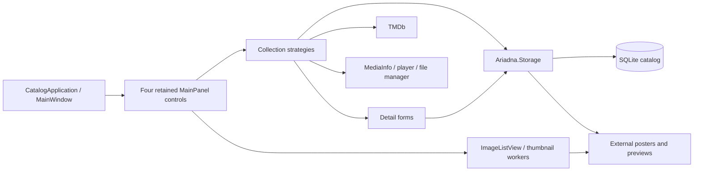

# Technical Design Description - Ariadna <!-- omit from toc -->

Last reviewed: 2026-10-03. This describes the current implementation unless a
section explicitly labels a proposal or an unverified target.

## Purpose

Ariadna is a personal media library management desktop application for Windows.
It lets the owner browse, search, and organize movies, documentaries, games, and
books in a poster grid. One application instance hosts four permanent catalog tabs.

This is the primary reference for developers and agents implementing or reviewing
Ariadna. It owns product behavior, architecture, and technical decisions; consult
source code for implementation details. Task status belongs in PLAN.md and dated
handoff evidence belongs in repository MEMORY.md.

## Scope

This document covers all six projects in `Ariadna.slnx`:

- **Ariadna** — WinForms desktop application, targeting `net10.0-windows8.0`
- **Ariadna.Storage** — direct SQLite storage, targeting `net10.0`
- **Ariadna.Storage.Tests** — real-provider integration tests, targeting `net10.0`
- **Ariadna.Tests** — MSTest characterization/unit tests, targeting `net10.0-windows8.0`
- **Ariadna.Migration** — standalone migration/recovery CLI, targeting `net10.0`
- **Ariadna.Migration.Tests** — synthetic import/compare/snapshot tests, targeting `net10.0`

The production backend is SQLite. The migration CLI and its tests participate
in solution-wide builds/tests; the desktop does not reference the CLI. Only SQL
export/comparison needs a SQL Server client. The desktop has no EF or SQL Server
dependency.

## References

| Reference | Purpose |
|---|---|
| [README.md](../README.md) | Requirements and build/test/run guidance, with verification limits |
| [AGENTS.md](../AGENTS.md) | Operational instructions, editing rules, testing and review conventions |
| [MEMORY.md](../MEMORY.md) | Compact dated handoff and evidence |
| [PLAN.md](PLAN.md) | Remaining/upcoming tasks and completion gates |
| [SQLite operation and recovery](SQLITE-OPERATIONS.md) | Implemented storage format, migration evidence, and backup/restore |
| [SQLite migration investigation](SQLITE-MIGRATION-PLAN.md) | Original rationale and dated source-data investigation |

## Abbreviations and Definitions

| Term | Meaning |
|---|---|
| TDD | Technical Design Description |
| EF6 | Entity Framework 6 |
| EDMX / T4 | Database-first model and entity/context generation templates |
| Collection mode | One of movies, documentaries, games, or library, selected by tab |
| Catalog assets | External posters/game previews and database-resident person photos |
| Matched recovery | Database, external images, and relevant configuration captured consistently |

## Unit Design Notes / Decisions

| Decision / current constraint | Reason and consequence |
|---|---|
| Windows WinForms desktop | Existing local media workflow; preserve native interactions and file/tool integration |
| One instance with four permanent tabs | Each retained catalog control owns its strategy, filters, grid state, and palette; subsequent launches activate the existing window |
| Category-specific strategies and detail forms | Collection fields, filters, discovery, and launch behavior differ; retain these differences |
| Direct SQLite commands in Ariadna.Storage | Explicit mapping, focused queries, complete-entry transactions, no server or ORM |
| External posters keyed by catalog ID | IDs connect rows to extensionless PNG image files; changing IDs or filenames breaks lookup |
| Embedded ImageListView fork | Existing custom grid/rendering/cache behavior; preserve its license and lifecycle handling |
| Recoverable image promotion | Durable staging journals and database commit tokens support startup recovery |

## Overview

`Program` runs `CatalogApplication`, which enforces one instance through the
WinForms application model and opens `MainWindow`. The shell hosts Movies,
Documentaries, Games, and Library as permanent tabs. It creates each `MainPanel`
user control, strategy, and palette on first selection and retains the view for
the window lifetime. Strategies retrieve filtered entries and coordinate
discovery, details, and execution. Detail forms save catalog data and related
images; thumbnail workers render cached posters.

### Context Map



### Considerations for a Secure Design

Catalog records, file paths, external images, and the TMDb key are user data.
Keep credentials and personal content out of committed fixtures and diagnostics.
The configured API key is currently an application setting; this document does
not claim encrypted credential storage. TMDb metadata retrieval uses network
access; browsing local data depends on the configured database and image paths.

Database and external files are separate persistence resources. Complete-entry
saves use a SQLite transaction plus recoverable image promotion. Snapshot backups
pause shared writers and copy both resources; see the operations guide.

### Considerations for Localization

The application uses resources and collection-specific controls. `ImdbLanguage`
selects TMDb request language, not a verified runtime UI-language picker.
Unicode text is retained. A registered en-US case-insensitive collation and
literal Unicode search functions support Cyrillic searches. Alphabetical ordering
is close to, but does not exactly match, the old SQL Server collation; measured
differences are recorded in the operations guide.

## Features

- **Poster thumbnail grid** — visual browsing of the full collection via a custom embedded ImageListView
- **Four media categories**, each with its own theme, color scheme, and icon:
  - Movies & TV Series
  - Documentaries
  - PC / VR Games
  - Books / Library
- **Filtering & search** — filter by title, director/author, actor, genre, subgenre, and flag-based toggles (wishlist, recently added, new releases, VR-only, series-only)
- **TMDb integration** — fetch movie metadata (title, year, poster, description, cast) from The Movie Database API
- **MediaInfo analysis** — read video resolution, bitrate, and audio track details from local files via MediaInfo
- **Quick-navigation bar** — alphabetical letter buttons for instant jump to any section of the list
- **Entry detail forms** — add, view, and edit full metadata for each entry including poster, genre tags, director/actor photos, and file path
- **File integration** — open video files in MPC-HC or browse directories in Total Commander directly from the UI
- **Ignore list** — shift-click to permanently skip a file during automatic discovery
- **Permanent catalog tabs** — one instance, independent retained view state, and Ctrl+Tab / Ctrl+Shift+Tab / Ctrl+1 through Ctrl+4 navigation
- **Theming** — instance palettes keep each catalog grid, picker, and detail form independent

---

## Requirements

- **OS**: Windows 10 or later (x64)
- **Runtime**: .NET 10.0 (net10.0-windows8.0); self-contained publishing includes it
- **Database**: a verified SQLite catalog plus matching external image directories
- **External tools** (optional, paths configured in `App.config`):
  - [MPC-HC](https://github.com/clsid2/mpc-hc) — media player for opening video files
  - [Total Commander](https://www.ghisler.com/) — file manager for browsing entry directories
- **TMDb API key** — required for movie metadata lookup (set in `App.config`)

---

## Configuration

All paths and keys are set in `Ariadna/App.config`. Update these before building or running:

| Setting | Description |
|---|---|
| `AriadnaCatalog` connection string | Absolute SQLite filename; normal startup uses ReadWrite and validates application/schema identity |
| `TmdbApiKey` | Your [TMDb API key](https://developer.themoviedb.org/docs/getting-started) |
| `MoviePostersRootPath` | Root directory where movie poster images are stored by entry ID |
| `GamePostersRootPath` | Root directory for game poster images |
| `DocumentaryPostersRootPath` | Root directory for documentary poster images |
| `LibraryPostersRootPath` | Root directory for library/book poster images |
| `DefaultMoviesPath` | Default directory scanned when discovering new movie files |
| `DefaultSeriesPath` | Default directory for TV series discovery |
| `DefaultGamesPath` | Default directory for game discovery |
| `DefaultDocumentariesPath` | Default directory for documentary discovery |
| `DefaultLibraryPath` | Default directory for book/document discovery |
| `TotalCommanderPath` | Full path to `TOTALCMD64.EXE` |
| `MediaPlayerPath` | Full path to `mpc-hc64.exe` |
| `PosterWidth` / `PosterHeight` | Poster image dimensions (default: 400×600) |
| `PreviewWidth` / `PreviewHeight` | Preview pane dimensions (default: 603×339) |
| `RecentInMonth` | How many months back counts as "recently added" (default: 3) |
| `VideoFilesFilter` | File extension filter for video file discovery (e.g. `*.mkv;*.mp4;*.avi`) |
| `ImdbLanguage` | Locale for TMDb API requests (e.g. `ru-RU`) |

Poster files are PNG images stored under extensionless `{id}` filenames inside
the configured root for each category. Game previews append `PreviewSuffix` and
numbers 1 through 4 (currently `_preview1` through `_preview4`). Person photos
are stored as byte arrays in the database. These identifiers and filenames are
part of the persistence contract.

Strategies/adaptors concatenate configured root paths with IDs; preserve the
required path separators. Typed settings are generated from
`Ariadna/Properties/Settings.settings`; runtime values are read through
`Settings.Default` and configuration. Do not publish actual credential values.

---

## Building

Use [README.md](../README.md) for build/test guidance and its verification limits.
All production projects are SDK-style and use locked NuGet dependencies. The
legacy DbProvider project, generated/linked models, EF packages, and EDMX/T4
build tooling have been removed. `Ariadna.slnx` includes all six projects and retains
the Debug/Release and Any CPU/x64/x86 solution configurations. `global.json` pins
SDK 10.0.401 with `latestPatch` roll-forward within 10.0.4xx and excludes previews.
Framework-dependent runs and consumers of the storage library now require .NET 10;
the schema and matched database/image recovery format are unchanged.

---

## Running

The application accepts an optional command-line argument to select a catalog tab:

```
Ariadna.exe movies          # Movies & TV series (default)
Ariadna.exe documentaries   # Documentaries
Ariadna.exe games           # PC / VR games
Ariadna.exe library         # Books & documents
```

The first launch without an argument opens **Movies**. A subsequent launch
activates the existing window; a named argument selects its tab, while no
argument preserves the active tab. A minimized window is restored. If a modal
editor is open, a requested switch waits until it closes.

The four tabs cannot be closed. Ctrl+Tab and Ctrl+Shift+Tab cycle with wrapping;
Ctrl+1 through Ctrl+4 select Movies, Documentaries, Games, and Library. Filters,
selection, scroll position, and palette persist when switching tabs. A pending
title search is applied before hiding its tab; transient pickers close. Closing
the main window disposes every loaded catalog view and its thumbnail resources.

---

## Architecture

### Strategy Pattern

The core design uses the Strategy pattern to keep category-specific behavior separate from the shared UI:

```
AbstractDbStrategy (abstract contract)
└── MediaDbStrategyBase (abstract, adds logging, poster adaptor, file/process ops)
    ├── MoviesDbStrategy     — movies + TV series, TMDb API
    ├── DocumentariesDbStrategy
    └── GamesDbStrategy      — PC / VR games
LibraryDbStrategy            — books (implements AbstractDbStrategy directly)
```

`MainWindow` creates a strategy and theme pair for each tab, then passes both
to its `MainPanel` user control. The main collection operations use
`AbstractDbStrategy`. Strategies and detail forms call focused `CatalogStore`
operations; SQL and mapping belong to the storage project.

Key strategy responsibilities:
- `GetEntries()` / `QueryEntries(QueryParams)` — data retrieval with filtering
- `ShowEntryDetails(int id)` — open the category-specific edit/detail dialog
- `ExecuteEntry(int id)` — open file in MPC-HC or directory in Total Commander
- `FindNextEntryAutomatically()` / `FindNextEntryManually()` — discover unregistered files on disk
- `RemoveEntry(int id)` — delete from DB and optionally from filesystem
- `FilterControls(MainPanel)` — show/hide toolbar controls irrelevant to the current category

### Data Layer

Direct `Microsoft.Data.Sqlite` queries with explicit scalar/BLOB mapping. The
original 19 data tables are retained, plus internal image commit metadata:

| Entity | Description |
|---|---|
| `Movie` | Movie / TV series entry with title, year, poster (byte[]), file path, description, cast, directors, genres |
| `Game` | PC or VR game entry |
| `Documentary` | Documentary entry |
| `Library` | Book / document entry with authors |
| `Actor` / `Director` / `Author` | People, with portrait photo stored as byte[] |
| `Genre` / `GenreOfGame` / `GenreOfDocumentary` / `GenreOfLibrary` | Genre lookup entities |
| `MovieCast` / `MovieDirector` / `MovieGenre` / `GameGenre` / `DocumentaryGenre` / `LibraryAuthor` / `LibraryGenre` | Collection-to-person/genre relationship entities |
| `Ignore` (`Ignores` context set) | Files permanently excluded from automatic discovery |

`CatalogStore` owns queries, people lookups, discovery/ignore paths, complete-entry
saves, and relationship-aware deletes. `CatalogDatabase` owns validated connections,
backup, integrity checks, writer coordination, and image-journal recovery. Lists and
entry information avoid loading photos; details and suggestions request them.
Recovery clears the read-only attribute on its own staging directories before
cleanup so empty leftovers do not block startup or later writes. Commit/rollback
decisions are unchanged; other filesystem access failures still propagate.

### Theming

`Theme` is an abstract instance palette created by `Theme.Create(CatalogKind)`.
Each concrete theme (`ThemeMovies`, `ThemeGames`, `ThemeDocumentaries`,
`ThemeLibrary`) initializes its own colors. Catalog controls and grid renderers
retain their palette; scrollbars and floating pickers receive those colors.
Independent detail forms explicitly apply their collection palette. Switching
tabs cannot change colors in an already loaded view. The shared splash screen
uses a fixed branding color.

### Display scaling

The existing layouts and embedded poster grid use pixel-based sizes. Runtime
startup explicitly uses `HighDpiMode.DpiUnaware`, preserving Windows bitmap
scaling and the pre-tab-refactor UI size on high-DPI displays. The application
model otherwise defaults to SystemAware, which changes those existing metrics.
`ApplicationHighDpiMode` records the same policy in the desktop project; the
custom application model explicitly sets its runtime property before startup.

`ForceDesignerDpiUnaware` runs WinForms designers at a 96-DPI baseline even when
Visual Studio is on a 150% display. This prevents monitor-dependent layout
serialization and does not itself configure runtime scaling. Native per-monitor
DPI rendering would require a separate conversion of custom pixel-based controls.

### Entry Detail Forms

`MovieDetailsForm`, `GameDetailsForm`, `DocumentaryDetailsForm`, and
`LibraryDetailsForm` each inherit directly from WinForms `Form`, with their own
designer and resources. Each owns its layout, loading, validation, and explicit
mapping to `CatalogDetails`. There is no shared detail-form base or save-hook chain.
The small `IEntryDetailsDialog` contract exposes the stored ID and close reason.

Shared behavior is composed into the forms:

- `GenreSelectionControl` owns genre normalization, duplicate/limit handling,
  paste/delete, and a disposable `FloatingPanel` picker. Existing lists above the
  configured limit remain intact; the limit applies to new additions.
- `PeopleEditorControl` owns paste, rename, delete, and portrait replacement,
  configured explicitly for director, actor, or author lookup. Enter commits a
  label edit without saving the dialog; F2 acts on that editor's selected person.
- `ImageEditorControl` owns cloned images and releases source file handles;
  `GamePreviewsControl` composes four numbered previews and the selected view.
- `FileSizeControl` and `VideoInfoControl` use `IFileInspectionService` for
  cancellable size and bundled MediaInfo work. Only movies/documentaries request
  video information; replaced or completed requests cannot apply stale results.
- `MovieDetailsForm` uses `ITmdbMetadataService` for movie/series metadata and
  missing portraits. Closing cancels requests; late metadata does not overwrite
  manual edits, and downloaded portraits do not replace manual portraits.
- `EntryEditorSession`, owned by the form's component container, handles lookup,
  save/ignore, keyboard commands, and save failure recovery without owning any
  collection controls. Forms are disposed by their modal callers.

Save still uses one existing `CatalogStore.Save` operation for metadata, genres,
people, and recoverable image promotion. IDs, unchanged nullable flags/dates,
undecorated descriptions, and configured poster/preview filenames are preserved.
Escape cancels editing; Shift-confirm ignores the path. TMDb choices accept Enter
or double-click and clear a selected index on cancellation.

The choice dialog explicitly uses `ManagerRenderMode` for its status bar to
preserve its existing appearance under .NET 10's changed WinForms default.

Automated shown-form checks use disposable real SQLite/image data, including
save/reopen, relationship clearing, cancellation, and delayed-result behavior.
The current verification scope and remaining native checks are recorded in
[PLAN.md](PLAN.md).

### Embedded ImageListView

The `Ariadna/ImageListView/` directory contains an embedded fork of the open-source [Manina Windows Forms ImageListView](https://github.com/oozcitak/imagelistview) control (license included). It provides:
- Background thumbnail extraction and caching
- Metadata extraction pipeline
- Custom renderer infrastructure
- Custom scrollbar

`ImageListViewAriadnaRenderer` extends the base renderer with a gradient background and an animated selection blink effect. `PosterFromFileAdaptor` is a custom `ImageListViewItemAdaptor` that loads poster images from the configured root directory using the entry ID as the filename.

---

## Project Structure

```
Ariadna.slnx
├── Ariadna/                        # Main WinForms application (net10.0-windows)
│   ├── Program.cs                  # Entry point — starts the single-instance application model
│   ├── CatalogApplication.cs       # Startup, splash, subsequent launch activation
│   ├── MainWindow.cs/.Designer.cs  # Four-tab shell, navigation, window geometry
│   ├── MainPanel.cs/.Designer.cs   # Retained collection user control
│   ├── Utilities.cs                # Genre dictionaries, image helpers, video duration
│   ├── App.config                  # Connection string and all application settings
│   ├── AuxiliaryPopups/            # Independent detail forms, composed editors/services, picker/choice dialogs
│   ├── Data/                       # DTOs (EntryDto, EntryInfo, MovieChoiceDto)
│   ├── DatabaseStrategies/         # AbstractDbStrategy + 4 concrete strategies + helpers
│   ├── Extension/                  # Static extension methods
│   ├── ImageListHelpers/           # Custom renderer and poster adaptor
│   ├── ImageListView/              # Embedded fork of Manina ImageListView (~30 files)
│   ├── Properties/                 # App settings, resources
│   ├── Resources/                  # PNG/BMP/ICO assets, 100+ genre icons
│   ├── SplashScreen/               # SplashForm managed by the application model
│   └── Themes/                     # Theme base + ThemeMovies/Games/Documentaries/Library
├── Ariadna.Storage/                # Focused SQLite operations, schema, image recovery
├── Ariadna.Storage.Tests/          # Real SQLite integration tests
├── Ariadna.Migration/              # Standalone export/import/compare/snapshot CLI
├── Ariadna.Migration.Tests/        # Synthetic migration/recovery tests
└── Ariadna.Tests/                  # MSTest unit test project (net10.0-windows)
    ├── AuxiliaryPopups/
    ├── DatabaseStrategies/
    ├── ImageListHelpers/
    └── MainWindowTests.cs / MainPanelTests.cs / UtilitiesTests.cs
```

---

## Dependencies

| Package | Version | Purpose |
|---|---|---|
| Microsoft.Data.Sqlite | 10.0.12 | Direct SQLite provider |
| SQLitePCLRaw.bundle_e_sqlite3 | 3.0.5 | Native SQLite 3.53.4 runtime |
| TMDbLib | 3.0.0 | The Movie Database REST API client |
| MediaInfo.Wrapper.Core | 26.1.0 | Video metadata (resolution, bitrate, audio) |
| SkiaSharp | 3.119.2 | Image processing |
| Microsoft.Extensions.Logging.Console | 10.0.5 | Console logging for strategies |
| System.Runtime.Serialization.Formatters | 10.0.5 | Legacy serialization support |
| Microsoft.NET.Test.Sdk | 18.4.0 | Test host |
| MSTest.TestFramework / TestAdapter | 4.2.1 | Unit testing |

Versions reflect project files and locked packages on 2026-10-03. Locked restores
use the SDK pin in global.json. The separate migration tool uses
Microsoft.Data.SqlClient 7.1.1 for SQL export/comparison only.

---

## Testing

Use [README.md](../README.md) for test commands. Tests follow the
`[MethodUnderTest]_[Precondition]_[ExpectedOutcome]` naming convention and the
Arrange / Act / Assert structure; see [AGENTS.md](../AGENTS.md) for the complete
repository testing rules.

Tests include retained workflow characterization, real SQLite query/write and
recovery integration, conversion/package failures, and automated shown WinForms
grid/detail checks in all four modes. See the operations guide for measured results
and the limits of automated native checks.

### Acceptance Scenarios

These are verification scenarios, not claims of completed checks. Run write
scenarios against disposable catalog/image copies.

| Workflow | Expected behavior / verification |
|---|---|
| Launch | First launch opens the requested tab or Movies; second launch activates the same process, restores a minimized window, and defers switching during modal editing |
| Tab navigation | Four permanent tabs retain their filters, selection, scroll position, controls, and colors; mouse selection and Ctrl+Tab / Ctrl+Shift+Tab / Ctrl+1 through Ctrl+4 work |
| Browse and filter | Poster grid and alphabetical navigation work; title, people, genre/subgenre, and applicable flags retain collection-specific results and ordering |
| Details and edits | Open an existing entry, edit metadata/images/relationships, save, reopen, and confirm persisted values; cancel retains saved data |
| Discovery and ignore | Manual/automatic discovery retain collection-specific paths/exclusions; ignore prevents later rediscovery |
| Execute and remove | Configured player/file manager receives the expected path; cancellation prevents deletion; optional filesystem removal respects the chosen action |
| Form lifecycle | Closing a form during directory/MediaInfo work cancels it without stale UI updates; images are released for replacement |
| SQLite migration | Compare every converted value/ID/hash, real-provider searches and failures, concurrent storage writers, and matched restore before production cutover |

## Non-Functional Considerations

Thumbnail decoding/caching, filesystem discovery, and MediaInfo work affect
perceived responsiveness independently of database performance. Long-running
work must respect form lifetime and keep UI updates on the owning thread.
There is no measured latency or migration speedup guarantee in this document.

The embedded ImageListView source and license remain part of the application.
Tests and builds do not prove native rendering, mouse/keyboard behavior, external
tool availability, or recovery of a production catalog.

## Storage evolution and verification limits

The approved SQLite migration is implemented. The initial source investigation
is retained in [SQLITE-MIGRATION-PLAN.md](SQLITE-MIGRATION-PLAN.md); current
storage/recovery behavior and migration evidence belong in
[SQLITE-OPERATIONS.md](SQLITE-OPERATIONS.md). IDs, NULLs, duplicate relationships,
photo bytes, and external filenames were verified before cutover.

A clean-machine installation and manual review of every control remain outside
the verified scope. Native automated checks exercise key browse/save/reopen paths.
On 2026-10-03 the user reported successful manual browse/details/edit/restart
checks across all four collections, including posters and game previews, using
the isolated full-data copy with version 2.0.1; see the operations guide.
Thumbnail decoding and external tool integration still affect responsiveness.
Future schema upgrades must take a matched backup first and advance the schema
version transactionally. Track future work in [PLAN.md](PLAN.md).

---

## Acknowledgements

- **[ImageListView](https://github.com/oozcitak/imagelistview)** by Ozgur Ozcitak — the thumbnail grid control embedded in `Ariadna/ImageListView/`. The source is included directly in the repository (with its license) and extended with a custom renderer and poster adaptor.
