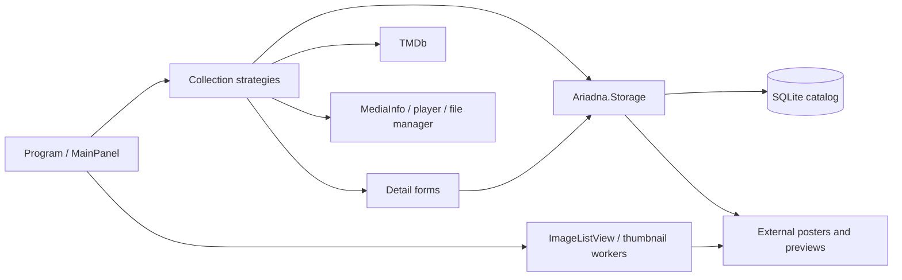

# Technical Design Description - Ariadna <!-- omit from toc -->

Last reviewed: 2026-10-03. This describes the current implementation unless a
section explicitly labels a proposal or an unverified target.

## Purpose

Ariadna is a personal media library management desktop application for Windows.
It lets the owner browse, search, and organize movies, documentaries, games, and
books in a poster grid. Each independently launched window manages one collection.

This is the primary reference for developers and agents implementing or reviewing
Ariadna. It owns product behavior, architecture, and technical decisions; consult
source code for implementation details. Task status belongs in PLAN.md and dated
handoff evidence belongs in repository MEMORY.md.

## Scope

This document covers all projects in `Ariadna.sln`:

- **Ariadna** — WinForms desktop application, targeting `net9.0-windows8.0`
- **Ariadna.Storage** — direct SQLite storage, targeting `net9.0`
- **Ariadna.Storage.Tests** — real-provider integration tests, targeting `net9.0`
- **Ariadna.Tests** — MSTest characterization/unit tests, targeting `net9.0-windows8.0`

The production backend is SQLite. `Ariadna.Migration` and its tests are separate
projects outside the production solution; only SQL export/comparison needs a SQL
Server client. The desktop has no EF or SQL Server dependency.

## References

| Reference | Purpose |
|---|---|
| [README.md](../README.md) | Requirements and build/test/run guidance, with verification limits |
| [AGENTS.md](../AGENTS.md) | Operational instructions, editing rules, testing and review conventions |
| [MEMORY.md](../MEMORY.md) | Compact dated handoff and evidence |
| [PLAN.md](PLAN.md) | Remaining/upcoming tasks and completion gates |
| [SQLite operation and recovery](SQLITE-OPERATIONS.md) | Implemented storage format, migration evidence, and backup/restore |
| [SQLite migration investigation](SQLITE-MIGRATION-PLAN.md) | Original rationale and dated source-data investigation |

## Abbreviations and Definitions

| Term | Meaning |
|---|---|
| TDD | Technical Design Description |
| EF6 | Entity Framework 6 |
| EDMX / T4 | Database-first model and entity/context generation templates |
| Collection mode | One of movies, documentaries, games, or library, selected at launch |
| Catalog assets | External posters/game previews and database-resident person photos |
| Matched recovery | Database, external images, and relevant configuration captured consistently |

## Unit Design Notes / Decisions

| Decision / current constraint | Reason and consequence |
|---|---|
| Windows WinForms desktop | Existing local media workflow; preserve native interactions and file/tool integration |
| One mode per process | Strategy and theme are selected before UI construction; independent modes can run simultaneously |
| Category-specific strategies and detail forms | Collection fields, filters, discovery, and launch behavior differ; retain these differences |
| Direct SQLite commands in Ariadna.Storage | Explicit mapping, focused queries, complete-entry transactions, no server or ORM |
| External posters keyed by catalog ID | IDs connect rows to extensionless PNG image files; changing IDs or filenames breaks lookup |
| Embedded ImageListView fork | Existing custom grid/rendering/cache behavior; preserve its license and lifecycle handling |
| Recoverable image promotion | Durable staging journals and database commit tokens support startup recovery |

## Overview

The owner selects a collection at launch. `Program` constructs its theme and
strategy, initializes the theme, then opens `MainPanel`. Strategies retrieve
filtered entries and coordinate discovery, details, and execution. Detail forms
save catalog data and related images; thumbnail workers render cached posters.

### Context Map



### Considerations for a Secure Design

Catalog records, file paths, external images, and the TMDb key are user data.
Keep credentials and personal content out of committed fixtures and diagnostics.
The configured API key is currently an application setting; this document does
not claim encrypted credential storage. TMDb metadata retrieval uses network
access; browsing local data depends on the configured database and image paths.

Database and external files are separate persistence resources. Complete-entry
saves use a SQLite transaction plus recoverable image promotion. Snapshot backups
pause shared writers and copy both resources; see the operations guide.

### Considerations for Localization

The application uses resources and collection-specific controls. `ImdbLanguage`
selects TMDb request language, not a verified runtime UI-language picker.
Unicode text is retained. A registered en-US case-insensitive collation and
literal Unicode search functions support Cyrillic searches. Alphabetical ordering
is close to, but does not exactly match, the old SQL Server collation; measured
differences are recorded in the operations guide.

## Features

- **Poster thumbnail grid** — visual browsing of the full collection via a custom embedded ImageListView
- **Four media categories**, each with its own theme, color scheme, and icon:
  - Movies & TV Series
  - Documentaries
  - PC / VR Games
  - Books / Library
- **Filtering & search** — filter by title, director/author, actor, genre, subgenre, and flag-based toggles (wishlist, recently added, new releases, VR-only, series-only)
- **TMDb integration** — fetch movie metadata (title, year, poster, description, cast) from The Movie Database API
- **MediaInfo analysis** — read video resolution, bitrate, and audio track details from local files via MediaInfo
- **Quick-navigation bar** — alphabetical letter buttons for instant jump to any section of the list
- **Entry detail forms** — add, view, and edit full metadata for each entry including poster, genre tags, director/actor photos, and file path
- **File integration** — open video files in MPC-HC or browse directories in Total Commander directly from the UI
- **Ignore list** — shift-click to permanently skip a file during automatic discovery
- **Theming** — static theme system applied before UI construction; each category has a distinct palette

---

## Requirements

- **OS**: Windows 10 or later (x64)
- **Runtime**: .NET 9.0 (net9.0-windows8.0)
- **Database**: a verified SQLite catalog plus matching external image directories
- **External tools** (optional, paths configured in `App.config`):
  - [MPC-HC](https://github.com/clsid2/mpc-hc) — media player for opening video files
  - [Total Commander](https://www.ghisler.com/) — file manager for browsing entry directories
- **TMDb API key** — required for movie metadata lookup (set in `App.config`)

---

## Configuration

All paths and keys are set in `Ariadna/App.config`. Update these before building or running:

| Setting | Description |
|---|---|
| `AriadnaCatalog` connection string | Absolute SQLite filename; normal startup uses ReadWrite and validates application/schema identity |
| `TmdbApiKey` | Your [TMDb API key](https://developer.themoviedb.org/docs/getting-started) |
| `MoviePostersRootPath` | Root directory where movie poster images are stored by entry ID |
| `GamePostersRootPath` | Root directory for game poster images |
| `DocumentaryPostersRootPath` | Root directory for documentary poster images |
| `LibraryPostersRootPath` | Root directory for library/book poster images |
| `DefaultMoviesPath` | Default directory scanned when discovering new movie files |
| `DefaultSeriesPath` | Default directory for TV series discovery |
| `DefaultGamesPath` | Default directory for game discovery |
| `DefaultDocumentariesPath` | Default directory for documentary discovery |
| `DefaultLibraryPath` | Default directory for book/document discovery |
| `TotalCommanderPath` | Full path to `TOTALCMD64.EXE` |
| `MediaPlayerPath` | Full path to `mpc-hc64.exe` |
| `PosterWidth` / `PosterHeight` | Poster image dimensions (default: 400×600) |
| `PreviewWidth` / `PreviewHeight` | Preview pane dimensions (default: 603×339) |
| `RecentInMonth` | How many months back counts as "recently added" (default: 3) |
| `VideoFilesFilter` | File extension filter for video file discovery (e.g. `*.mkv;*.mp4;*.avi`) |
| `ImdbLanguage` | Locale for TMDb API requests (e.g. `ru-RU`) |

Poster files are PNG images stored under extensionless `{id}` filenames inside
the configured root for each category. Game previews append `PreviewSuffix` and
numbers 1 through 4 (currently `_preview1` through `_preview4`). Person photos
are stored as byte arrays in the database. These identifiers and filenames are
part of the persistence contract.

Strategies/adaptors concatenate configured root paths with IDs; preserve the
required path separators. Typed settings are generated from
`Ariadna/Properties/Settings.settings`; runtime values are read through
`Settings.Default` and configuration. Do not publish actual credential values.

---

## Building

Use [README.md](../README.md) for build/test guidance and its verification limits.
All production projects are SDK-style and use locked NuGet dependencies. The
legacy DbProvider project, generated/linked models, EF packages, and EDMX/T4
build tooling have been removed.

---

## Running

The application accepts a single command-line argument to select the media category:

```
Ariadna.exe movies          # Movies & TV series (default)
Ariadna.exe documentaries   # Documentaries
Ariadna.exe games           # PC / VR games
Ariadna.exe library         # Books & documents
```

Running without an argument defaults to the **movies** mode. Each invocation is an independent window — you can run all four simultaneously.

---

## Architecture

### Strategy Pattern

The core design uses the Strategy pattern to keep category-specific behavior separate from the shared UI:

```
AbstractDbStrategy (abstract contract)
└── MediaDbStrategyBase (abstract, adds logging, poster adaptor, file/process ops)
    ├── MoviesDbStrategy     — movies + TV series, TMDb API
    ├── DocumentariesDbStrategy
    └── GamesDbStrategy      — PC / VR games
LibraryDbStrategy            — books (implements AbstractDbStrategy directly)
```

`Program.cs` selects a strategy and theme pair based on the command-line argument,
then passes the strategy to `MainPanel`. The main collection operations use
`AbstractDbStrategy`. Strategies and detail forms call focused `CatalogStore`
operations; SQL and mapping belong to the storage project.

Key strategy responsibilities:
- `GetEntries()` / `QueryEntries(QueryParams)` — data retrieval with filtering
- `ShowEntryDetails(int id)` — open the category-specific edit/detail dialog
- `ExecuteEntry(int id)` — open file in MPC-HC or directory in Total Commander
- `FindNextEntryAutomatically()` / `FindNextEntryManually()` — discover unregistered files on disk
- `RemoveEntry(int id)` — delete from DB and optionally from filesystem
- `FilterControls(MainPanel)` — show/hide toolbar controls irrelevant to the current category

### Data Layer

Direct `Microsoft.Data.Sqlite` queries with explicit scalar/BLOB mapping. The
original 19 data tables are retained, plus internal image commit metadata:

| Entity | Description |
|---|---|
| `Movie` | Movie / TV series entry with title, year, poster (byte[]), file path, description, cast, directors, genres |
| `Game` | PC or VR game entry |
| `Documentary` | Documentary entry |
| `Library` | Book / document entry with authors |
| `Actor` / `Director` / `Author` | People, with portrait photo stored as byte[] |
| `Genre` / `GenreOfGame` / `GenreOfDocumentary` / `GenreOfLibrary` | Genre lookup entities |
| `MovieCast` / `MovieDirector` / `MovieGenre` / `GameGenre` / `DocumentaryGenre` / `LibraryAuthor` / `LibraryGenre` | Collection-to-person/genre relationship entities |
| `Ignore` (`Ignores` context set) | Files permanently excluded from automatic discovery |

`CatalogStore` owns queries, people lookups, discovery/ignore paths, complete-entry
saves, and relationship-aware deletes. `CatalogDatabase` owns validated connections,
backup, integrity checks, writer coordination, and image-journal recovery. Lists and
entry information avoid loading photos; details and suggestions request them.

### Theming

`Theme` is an abstract class holding static color fields used throughout the UI.
Each concrete theme (`ThemeMovies`, `ThemeGames`, `ThemeDocumentaries`,
`ThemeLibrary`) overrides the instance method `Init()` to populate these fields.
`Program` initializes the selected theme before constructing windows. Different
collection palettes run in separate processes rather than separate themes in
one shared process.

### Entry Detail Forms

`DetailsForm` (abstract base) provides shared detail/edit dialog behavior:
- Async directory size calculation with cancellation
- Async MediaInfo loading (resolution, bitrate, audio language detection)
- Duration lookup through the bundled MediaInfo reader; no Windows Shell dependency
- Genre picker via `FloatingPanel` overlay
- Director/actor photo management
- Templated DB save flow: `StorePreEntryData()` → `StoreMainEntry()` → `StorePostEntryData()` → `StoreRelatedData()`

Concrete subclasses: `MovieDetailsForm`, `GameDetailsForm`, `DocumentaryDetailsForm`, `LibraryDetailsForm`.

The template flow remains for workflow characterization. Production forms save
metadata, people, and genres through one complete-entry storage operation; the
pre/post hooks are no-ops. Selected images participate in recoverable promotion.
Background directory/MediaInfo work retains existing cancellation, disposal, and
stale-result guards. Automated shown-form checks use disposable SQLite/image data.

### Embedded ImageListView

The `Ariadna/ImageListView/` directory contains an embedded fork of the open-source [Manina Windows Forms ImageListView](https://github.com/oozcitak/imagelistview) control (license included). It provides:
- Background thumbnail extraction and caching
- Metadata extraction pipeline
- Custom renderer infrastructure
- Custom scrollbar

`ImageListViewAriadnaRenderer` extends the base renderer with a gradient background and an animated selection blink effect. `PosterFromFileAdaptor` is a custom `ImageListViewItemAdaptor` that loads poster images from the configured root directory using the entry ID as the filename.

---

## Project Structure

```
Ariadna.sln
├── Ariadna/                        # Main WinForms application (net9.0-windows)
│   ├── Program.cs                  # Entry point — selects strategy + theme by CLI arg
│   ├── MainPanel.cs/.Designer.cs   # Main application window
│   ├── Utilities.cs                # Genre dictionaries, image helpers, video duration
│   ├── App.config                  # Connection string and all application settings
│   ├── AuxiliaryPopups/            # Modal dialogs (DetailsForm, FloatingPanel, ChoicePopup)
│   ├── Data/                       # DTOs (EntryDto, EntryInfo, MovieChoiceDto)
│   ├── DatabaseStrategies/         # AbstractDbStrategy + 4 concrete strategies + helpers
│   ├── Extension/                  # Static extension methods
│   ├── ImageListHelpers/           # Custom renderer and poster adaptor
│   ├── ImageListView/              # Embedded fork of Manina ImageListView (~30 files)
│   ├── Properties/                 # App settings, resources
│   ├── Resources/                  # PNG/BMP/ICO assets, 100+ genre icons
│   ├── SplashScreen/               # SplashForm and Splasher helper
│   └── Themes/                     # Theme base + ThemeMovies/Games/Documentaries/Library
├── Ariadna.Storage/                # Focused SQLite operations, schema, image recovery
├── Ariadna.Storage.Tests/          # Real SQLite integration tests
└── Ariadna.Tests/                  # MSTest unit test project (net9.0-windows)
    ├── AuxiliaryPopups/
    ├── DatabaseStrategies/
    ├── ImageListHelpers/
    └── MainPanelTests.cs / UtilitiesTests.cs
```

---

## Dependencies

| Package | Version | Purpose |
|---|---|---|
| Microsoft.Data.Sqlite | 10.0.12 | Direct SQLite provider |
| SQLitePCLRaw.bundle_e_sqlite3 | 3.0.5 | Native SQLite 3.53.4 runtime |
| TMDbLib | 3.0.0 | The Movie Database REST API client |
| MediaInfo.Wrapper.Core | 26.1.0 | Video metadata (resolution, bitrate, audio) |
| SkiaSharp | 3.119.2 | Image processing |
| Microsoft.Extensions.Logging.Console | 10.0.5 | Console logging for strategies |
| System.Runtime.Serialization.Formatters | 10.0.5 | Legacy serialization support |
| Microsoft.NET.Test.Sdk | 18.4.0 | Test host |
| MSTest.TestFramework / TestAdapter | 4.2.1 | Unit testing |

Versions reflect project files and locked packages on 2026-10-03. Locked restores
are verified; no SDK pin is configured. The separate migration tool uses
Microsoft.Data.SqlClient 7.1.1 for SQL export/comparison only.

---

## Testing

Use [README.md](../README.md) for test commands. Tests follow the
`[MethodUnderTest]_[Precondition]_[ExpectedOutcome]` naming convention and the
Arrange / Act / Assert structure; see [AGENTS.md](../AGENTS.md) for the complete
repository testing rules.

Tests include retained workflow characterization, real SQLite query/write and
recovery integration, conversion/package failures, and automated shown WinForms
grid/detail checks in all four modes. See the operations guide for measured results
and the limits of automated native checks.

### Acceptance Scenarios

These are verification scenarios, not claims of completed checks. Run write
scenarios against disposable catalog/image copies.

| Workflow | Expected behavior / verification |
|---|---|
| Launch | No argument opens movies; each named mode selects its strategy/theme; four processes can coexist |
| Browse and filter | Poster grid and alphabetical navigation work; title, people, genre/subgenre, and applicable flags retain collection-specific results and ordering |
| Details and edits | Open an existing entry, edit metadata/images/relationships, save, reopen, and confirm persisted values; cancel retains saved data |
| Discovery and ignore | Manual/automatic discovery retain collection-specific paths/exclusions; ignore prevents later rediscovery |
| Execute and remove | Configured player/file manager receives the expected path; cancellation prevents deletion; optional filesystem removal respects the chosen action |
| Form lifecycle | Closing a form during directory/MediaInfo work cancels it without stale UI updates; images are released for replacement |
| SQLite migration | Compare every converted value/ID/hash, real-provider searches and failures, concurrent windows, and matched restore before production cutover |

## Non-Functional Considerations

Thumbnail decoding/caching, filesystem discovery, and MediaInfo work affect
perceived responsiveness independently of database performance. Long-running
work must respect form lifetime and keep UI updates on the owning thread.
There is no measured latency or migration speedup guarantee in this document.

The embedded ImageListView source and license remain part of the application.
Tests and builds do not prove native rendering, mouse/keyboard behavior, external
tool availability, or recovery of a production catalog.

## Storage evolution and verification limits

The approved SQLite migration is implemented. The initial source investigation
is retained in [SQLITE-MIGRATION-PLAN.md](SQLITE-MIGRATION-PLAN.md); current
storage/recovery behavior and migration evidence belong in
[SQLITE-OPERATIONS.md](SQLITE-OPERATIONS.md). IDs, NULLs, duplicate relationships,
photo bytes, and external filenames were verified before cutover.

A clean-machine installation and manual review of every control remain outside
the verified scope. Native automated checks exercise key browse/save/reopen paths.
On 2026-10-03 the user reported successful manual browse/details/edit/restart
checks across all four collections, including posters and game previews, using
the isolated full-data copy with version 2.0.1; see the operations guide.
Thumbnail decoding and external tool integration still affect responsiveness.
Future schema upgrades must take a matched backup first and advance the schema
version transactionally. Track future work in [PLAN.md](PLAN.md).

---

## Acknowledgements

- **[ImageListView](https://github.com/oozcitak/imagelistview)** by Ozgur Ozcitak — the thumbnail grid control embedded in `Ariadna/ImageListView/`. The source is included directly in the repository (with its license) and extended with a custom renderer and poster adaptor.
