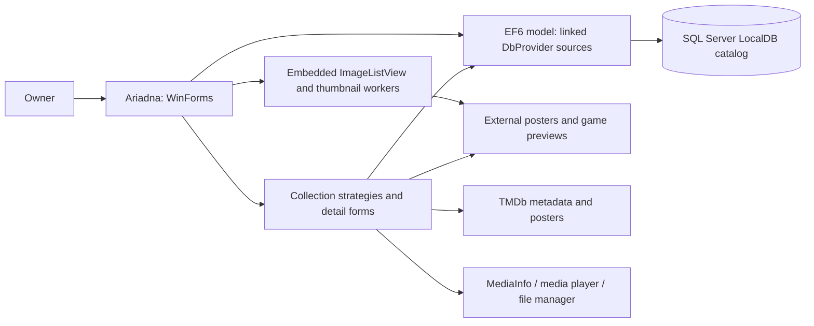

# Technical Design Description - Ariadna <!-- omit from toc -->

Last reviewed: 2026-10-03. This describes the current implementation unless a
section explicitly labels a proposal or an unverified target.

## Purpose

Ariadna is a personal media library management desktop application for Windows.
It lets the owner browse, search, and organize movies, documentaries, games, and
books in a poster grid. Each independently launched window manages one collection.

This is the primary reference for developers and agents implementing or reviewing
Ariadna. It owns product behavior, architecture, and technical decisions; consult
source code for implementation details. Task status belongs in PLAN.md and dated
handoff evidence belongs in repository MEMORY.md.

## Scope

This document covers all projects in `Ariadna.sln`:

- **Ariadna** — WinForms desktop application, targeting `net9.0-windows8.0`
- **DbProvider** — EF6 Database-First model and legacy .NET Framework 4.8 project
- **Ariadna.Tests** — MSTest characterization/unit tests, targeting `net9.0-windows8.0`

The production backend remains SQL Server LocalDB. Direct SQLite storage is a
proposal described in the focused migration investigation; no conversion or
cutover has been implemented by this documentation change.

## References

| Reference | Purpose |
|---|---|
| [README.md](../README.md) | Requirements and build/test/run guidance, with verification limits |
| [AGENTS.md](../AGENTS.md) | Operational instructions, editing rules, testing and review conventions |
| [MEMORY.md](../MEMORY.md) | Compact dated handoff and evidence |
| [PLAN.md](PLAN.md) | Remaining/upcoming tasks and completion gates |
| [SQLite migration investigation](SQLITE-MIGRATION-PLAN.md) | Detailed proposal and dated source-data investigation |

## Abbreviations and Definitions

| Term | Meaning |
|---|---|
| TDD | Technical Design Description |
| EF6 | Entity Framework 6 |
| EDMX / T4 | Database-first model and entity/context generation templates |
| Collection mode | One of movies, documentaries, games, or library, selected at launch |
| Catalog assets | External posters/game previews and database-resident person photos |
| Matched recovery | Database, external images, and relevant configuration captured consistently |

## Unit Design Notes / Decisions

| Decision / current constraint | Reason and consequence |
|---|---|
| Windows WinForms desktop | Existing local media workflow; preserve native interactions and file/tool integration |
| One mode per process | Strategy and theme are selected before UI construction; independent modes can run simultaneously |
| Category-specific strategies and detail forms | Collection fields, filters, discovery, and launch behavior differ; retain these differences |
| EF6 Database-First with LocalDB | Current persisted model; generated files and legacy build tooling remain dependencies |
| External posters keyed by catalog ID | IDs connect rows to extensionless PNG image files; changing IDs or filenames breaks lookup |
| Embedded ImageListView fork | Existing custom grid/rendering/cache behavior; preserve its license and lifecycle handling |
| SQLite replacement is proposed | Recovery, lossless conversion, compatibility, and native acceptance gates precede cutover |

## Overview

The owner selects a collection at launch. `Program` constructs its theme and
strategy, initializes the theme, then opens `MainPanel`. Strategies retrieve
filtered entries and coordinate discovery, details, and execution. Detail forms
save catalog data and related images; thumbnail workers render cached posters.

### Context Map



The direct desktop-to-model edge reflects existing lookup cleanup in MainPanel.
Persistence is currently spread across strategies and forms; the diagram does
not imply an isolated storage layer already exists.

### Considerations for a Secure Design

Catalog records, file paths, external images, and the TMDb key are user data.
Keep credentials and personal content out of committed fixtures and diagnostics.
The configured API key is currently an application setting; this document does
not claim encrypted credential storage. TMDb metadata retrieval uses network
access; browsing local data depends on the configured database and image paths.

Database and external files are separate persistence resources. Current save
steps are not one atomic database/filesystem operation. Recovery and any storage
migration must preserve a matched catalog/assets set; proposed transaction and
image-compensation changes are detailed in the migration investigation.

### Considerations for Localization

The application uses resources and collection-specific controls. `ImdbLanguage`
selects TMDb request language, not a verified runtime UI-language picker.
Preserve Unicode titles, people, genres, and paths. A SQLite replacement needs
an explicit Unicode comparison policy and provider tests before cutover; it
must not assume SQLite's default text comparison matches the current backend.

## Features

- **Poster thumbnail grid** — visual browsing of the full collection via a custom embedded ImageListView
- **Four media categories**, each with its own theme, color scheme, and icon:
  - Movies & TV Series
  - Documentaries
  - PC / VR Games
  - Books / Library
- **Filtering & search** — filter by title, director/author, actor, genre, subgenre, and flag-based toggles (wishlist, recently added, new releases, VR-only, series-only)
- **TMDb integration** — fetch movie metadata (title, year, poster, description, cast) from The Movie Database API
- **MediaInfo analysis** — read video resolution, bitrate, and audio track details from local files via MediaInfo
- **Quick-navigation bar** — alphabetical letter buttons for instant jump to any section of the list
- **Entry detail forms** — add, view, and edit full metadata for each entry including poster, genre tags, director/actor photos, and file path
- **File integration** — open video files in MPC-HC or browse directories in Total Commander directly from the UI
- **Ignore list** — shift-click to permanently skip a file during automatic discovery
- **Theming** — static theme system applied before UI construction; each category has a distinct palette

---

## Requirements

- **OS**: Windows 10 or later (x64)
- **Runtime**: .NET 9.0 (net9.0-windows8.0)
- **Database**: SQL Server LocalDB (ships with Visual Studio or can be installed separately via the SQL Server Express LocalDB installer)
- **External tools** (optional, paths configured in `App.config`):
  - [MPC-HC](https://github.com/clsid2/mpc-hc) — media player for opening video files
  - [Total Commander](https://www.ghisler.com/) — file manager for browsing entry directories
- **TMDb API key** — required for movie metadata lookup (set in `App.config`)

---

## Configuration

All paths and keys are set in `Ariadna/App.config`. Update these before building or running:

| Setting | Description |
|---|---|
| `connectionStrings` | Path to the `.mdf` database file (SQL Server LocalDB connection string) |
| `TmdbApiKey` | Your [TMDb API key](https://developer.themoviedb.org/docs/getting-started) |
| `MoviePostersRootPath` | Root directory where movie poster images are stored by entry ID |
| `GamePostersRootPath` | Root directory for game poster images |
| `DocumentaryPostersRootPath` | Root directory for documentary poster images |
| `LibraryPostersRootPath` | Root directory for library/book poster images |
| `DefaultMoviesPath` | Default directory scanned when discovering new movie files |
| `DefaultSeriesPath` | Default directory for TV series discovery |
| `DefaultGamesPath` | Default directory for game discovery |
| `DefaultDocumentariesPath` | Default directory for documentary discovery |
| `DefaultLibraryPath` | Default directory for book/document discovery |
| `TotalCommanderPath` | Full path to `TOTALCMD64.EXE` |
| `MediaPlayerPath` | Full path to `mpc-hc64.exe` |
| `PosterWidth` / `PosterHeight` | Poster image dimensions (default: 400×600) |
| `PreviewWidth` / `PreviewHeight` | Preview pane dimensions (default: 603×339) |
| `RecentInMonth` | How many months back counts as "recently added" (default: 3) |
| `VideoFilesFilter` | File extension filter for video file discovery (e.g. `*.mkv;*.mp4;*.avi`) |
| `ImdbLanguage` | Locale for TMDb API requests (e.g. `ru-RU`) |

Poster files are PNG images stored under extensionless `{id}` filenames inside
the configured root for each category. Game previews append `PreviewSuffix` and
numbers 1 through 4 (currently `_preview1` through `_preview4`). Person photos
are stored as byte arrays in the database. These identifiers and filenames are
part of the persistence contract.

Strategies/adaptors concatenate configured root paths with IDs; preserve the
required path separators. Typed settings are generated from
`Ariadna/Properties/Settings.settings`; runtime values are read through
`Settings.Default` and configuration. Do not publish actual credential values.

---

## Building

Use [README.md](../README.md) for build/test guidance and its verification limits.
`DbProvider` is an old-style .NET Framework 4.8 project with `packages.config`.
The desktop references that project, directly compiles its generated entity/context
files, and links the EDMX. Both model compilation paths currently exist; suppressing
CS0436 does not remove the duplicate types or the legacy project dependency.

---

## Running

The application accepts a single command-line argument to select the media category:

```
Ariadna.exe movies          # Movies & TV series (default)
Ariadna.exe documentaries   # Documentaries
Ariadna.exe games           # PC / VR games
Ariadna.exe library         # Books & documents
```

Running without an argument defaults to the **movies** mode. Each invocation is an independent window — you can run all four simultaneously.

---

## Architecture

### Strategy Pattern

The core design uses the Strategy pattern to keep category-specific behavior separate from the shared UI:

```
AbstractDbStrategy (abstract contract)
└── MediaDbStrategyBase (abstract, adds logging, poster adaptor, file/process ops)
    ├── MoviesDbStrategy     — movies + TV series, TMDb API
    ├── DocumentariesDbStrategy
    └── GamesDbStrategy      — PC / VR games
LibraryDbStrategy            — books (implements AbstractDbStrategy directly)
```

`Program.cs` selects a strategy and theme pair based on the command-line argument,
then passes the strategy to `MainPanel`. The main collection operations use
`AbstractDbStrategy`. MainPanel also contains direct EF lookup cleanup; this is
an existing exception to that boundary, identified for the proposed migration.

Key strategy responsibilities:
- `GetEntries()` / `QueryEntries(QueryParams)` — data retrieval with filtering
- `ShowEntryDetails(int id)` — open the category-specific edit/detail dialog
- `ExecuteEntry(int id)` — open file in MPC-HC or directory in Total Commander
- `FindNextEntryAutomatically()` / `FindNextEntryManually()` — discover unregistered files on disk
- `RemoveEntry(int id)` — delete from DB and optionally from filesystem
- `FilterControls(MainPanel)` — show/hide toolbar controls irrelevant to the current category

### Data Layer

Entity Framework 6 Database-First targeting SQL Server LocalDB. The EDMX model lives in the `DbProvider` project and generates entity classes via T4 templates. The main entities are:

| Entity | Description |
|---|---|
| `Movie` | Movie / TV series entry with title, year, poster (byte[]), file path, description, cast, directors, genres |
| `Game` | PC or VR game entry |
| `Documentary` | Documentary entry |
| `Library` | Book / document entry with authors |
| `Actor` / `Director` / `Author` | People, with portrait photo stored as byte[] |
| `Genre` / `GenreOfGame` / `GenreOfDocumentary` / `GenreOfLibrary` | Genre lookup entities |
| `MovieCast` / `MovieDirector` / `MovieGenre` / `GameGenre` / `DocumentaryGenre` / `LibraryAuthor` / `LibraryGenre` | Collection-to-person/genre relationship entities |
| `Ignore` (`Ignores` context set) | Files permanently excluded from automatic discovery |

Strategies, detail forms, shared save helpers, and MainPanel cleanup access EF
directly. Generated sources live in DbProvider and are linked into Ariadna.
There is currently no separate storage service owning complete-entry transactions.

### Theming

`Theme` is an abstract class holding static color fields used throughout the UI.
Each concrete theme (`ThemeMovies`, `ThemeGames`, `ThemeDocumentaries`,
`ThemeLibrary`) overrides the instance method `Init()` to populate these fields.
`Program` initializes the selected theme before constructing windows. Different
collection palettes run in separate processes rather than separate themes in
one shared process.

### Entry Detail Forms

`DetailsForm` (abstract base) provides shared detail/edit dialog behavior:
- Async directory size calculation with cancellation
- Async MediaInfo loading (resolution, bitrate, audio language detection)
- Genre picker via `FloatingPanel` overlay
- Director/actor photo management
- Templated DB save flow: `StorePreEntryData()` → `StoreMainEntry()` → `StorePostEntryData()` → `StoreRelatedData()`

Concrete subclasses: `MovieDetailsForm`, `GameDetailsForm`, `DocumentaryDetailsForm`, `LibraryDetailsForm`.

The shared store flow makes multiple EF save calls and then writes external
images. It is not currently a single transaction over the complete entry and
relationships. Background directory/MediaInfo work has cancellation and UI
update guards; preserve cancellation, disposal, and stale-result handling when
changing form lifecycle. Characterization tests cover substituted save steps;
they do not establish live database atomicity or filesystem recovery.

### Embedded ImageListView

The `Ariadna/ImageListView/` directory contains an embedded fork of the open-source [Manina Windows Forms ImageListView](https://github.com/oozcitak/imagelistview) control (license included). It provides:
- Background thumbnail extraction and caching
- Metadata extraction pipeline
- Custom renderer infrastructure
- Custom scrollbar

`ImageListViewAriadnaRenderer` extends the base renderer with a gradient background and an animated selection blink effect. `PosterFromFileAdaptor` is a custom `ImageListViewItemAdaptor` that loads poster images from the configured root directory using the entry ID as the filename.

---

## Project Structure

```
Ariadna.sln
├── Ariadna/                        # Main WinForms application (net9.0-windows)
│   ├── Program.cs                  # Entry point — selects strategy + theme by CLI arg
│   ├── MainPanel.cs/.Designer.cs   # Main application window
│   ├── Utilities.cs                # Genre dictionaries, image helpers, video duration
│   ├── App.config                  # Connection string and all application settings
│   ├── AuxiliaryPopups/            # Modal dialogs (DetailsForm, FloatingPanel, ChoicePopup)
│   ├── Data/                       # DTOs (EntryDto, EntryInfo, MovieChoiceDto)
│   ├── DatabaseStrategies/         # AbstractDbStrategy + 4 concrete strategies + helpers
│   ├── Extension/                  # Static extension methods
│   ├── ImageListHelpers/           # Custom renderer and poster adaptor
│   ├── ImageListView/              # Embedded fork of Manina ImageListView (~30 files)
│   ├── Properties/                 # App settings, resources
│   ├── Resources/                  # PNG/BMP/ICO assets, 100+ genre icons
│   ├── SplashScreen/               # SplashForm and Splasher helper
│   └── Themes/                     # Theme base + ThemeMovies/Games/Documentaries/Library
├── DbProvider/                     # EF6 Database-First data project (.NET Framework 4.8)
│   ├── AriadnaModel.edmx           # EF designer model
│   ├── AriadnaModel.Context.cs     # DbContext (AriadnaEntities)
│   └── *.cs / *.tt                 # T4-generated entity classes
└── Ariadna.Tests/                  # MSTest unit test project (net9.0-windows)
    ├── AuxiliaryPopups/
    ├── DatabaseStrategies/
    ├── ImageListHelpers/
    └── MainPanelTests.cs / UtilitiesTests.cs
```

---

## Dependencies

| Package | Version | Purpose |
|---|---|---|
| EntityFramework | 6.5.1 | Database-First ORM (SQL Server LocalDB) |
| TMDbLib | 3.0.0 | The Movie Database REST API client |
| MediaInfo.Wrapper.Core | 26.1.0 | Video metadata (resolution, bitrate, audio) |
| Microsoft.WindowsAPICodePack-Shell | 1.1.0.0 | File duration via Windows Shell |
| SkiaSharp | 3.119.2 | Image processing |
| Microsoft.Extensions.Logging.Console | 10.0.5 | Console logging for strategies |
| System.Runtime.Serialization.Formatters | 10.0.5 | Legacy serialization support |
| Microsoft.NET.Test.Sdk | 18.4.0 | Test host |
| MSTest.TestFramework / TestAdapter | 4.2.1 | Unit testing |

Versions above reflect the inspected project files on 2026-10-03. No SDK pin or
NuGet lock files currently establish reproducible restore. Dependency upgrades
and warning-suppression cleanup require their own validation.

---

## Testing

Use [README.md](../README.md) for test commands. Tests follow the
`[MethodUnderTest]_[Precondition]_[ExpectedOutcome]` naming convention and the
Arrange / Act / Assert structure; see [AGENTS.md](../AGENTS.md) for the complete
repository testing rules.

Existing query characterization tests use in-memory IQueryable sources, and
store-workflow tests replace persistence steps. They characterize workflows;
provider-backed queries, complete-entry transactions, and native interaction
need separate verification. No application build, tests, or native UI checks
were run for the 2026-10-03 documentation alignment.

### Acceptance Scenarios

These are verification scenarios, not claims of completed checks. Run write
scenarios against disposable catalog/image copies.

| Workflow | Expected behavior / verification |
|---|---|
| Launch | No argument opens movies; each named mode selects its strategy/theme; four processes can coexist |
| Browse and filter | Poster grid and alphabetical navigation work; title, people, genre/subgenre, and applicable flags retain collection-specific results and ordering |
| Details and edits | Open an existing entry, edit metadata/images/relationships, save, reopen, and confirm persisted values; cancel retains saved data |
| Discovery and ignore | Manual/automatic discovery retain collection-specific paths/exclusions; ignore prevents later rediscovery |
| Execute and remove | Configured player/file manager receives the expected path; cancellation prevents deletion; optional filesystem removal respects the chosen action |
| Form lifecycle | Closing a form during directory/MediaInfo work cancels it without stale UI updates; images are released for replacement |
| SQLite proposal | Compare every converted value/ID/hash, real-provider searches and failures, concurrent windows, and matched restore before production cutover |

## Non-Functional Considerations

Thumbnail decoding/caching, filesystem discovery, and MediaInfo work affect
perceived responsiveness independently of database performance. Long-running
work must respect form lifetime and keep UI updates on the owning thread.
There is no measured latency or migration speedup guarantee in this document.

The embedded ImageListView source and license remain part of the application.
Tests and builds do not prove native rendering, mouse/keyboard behavior, external
tool availability, or recovery of a production catalog.

## Proposed Storage Evolution

The [SQLite migration investigation](SQLITE-MIGRATION-PLAN.md) proposes direct
`Microsoft.Data.Sqlite` storage, focused operations, and a separate one-time
conversion utility. Its 2026-10-03 source-data observations are dated evidence,
not continuously verified inventory. Keep detailed schema comparisons and
conversion gates in that investigation instead of duplicating them here.

Migration must preserve IDs, NULL distinctions, original relationships including
duplicates, person-photo bytes, external filenames, and collection behavior.
Proposed reliability changes include complete-entry transactions, explicit empty
relationship replacement, and recoverable external-image promotion. These
changes have not been implemented. The current app continues using LocalDB
until lossless conversion, all-mode acceptance, and final recovery gates pass.

## Open Choices

- Supported SDK/build tooling and reproducible package restore for the mixed solution
- Approval and implementation scope of the SQLite migration proposal
- Unicode search/order policy and compatibility with the existing database
- Storage project boundaries, provider/native runtime version, and concurrency handling
- Recoverable database/image writes and matched backup/restore workflow
- Practical performance baseline and deployment validation without LocalDB

Track remaining work in [PLAN.md](PLAN.md); do not turn these proposals into
accepted decisions without resolving them in the task context.

---

## Acknowledgements

- **[ImageListView](https://github.com/oozcitak/imagelistview)** by Ozgur Ozcitak — the thumbnail grid control embedded in `Ariadna/ImageListView/`. The source is included directly in the repository (with its license) and extended with a custom renderer and poster adaptor.
